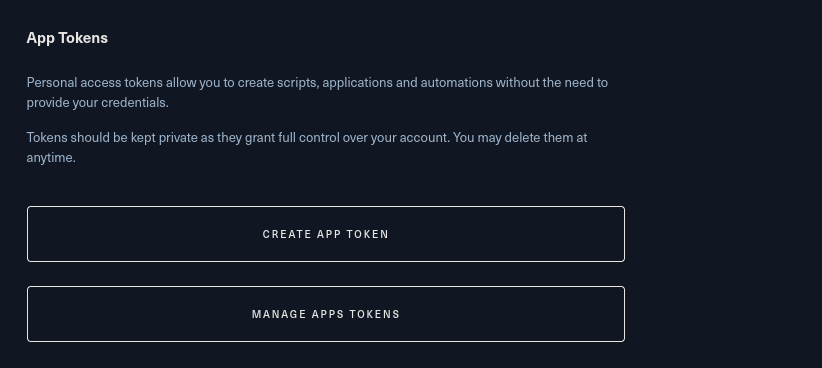
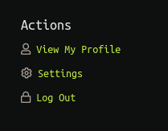
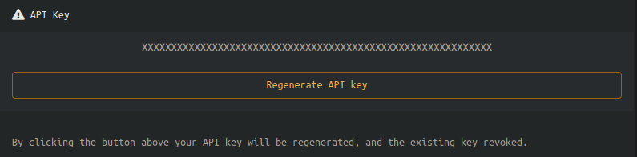
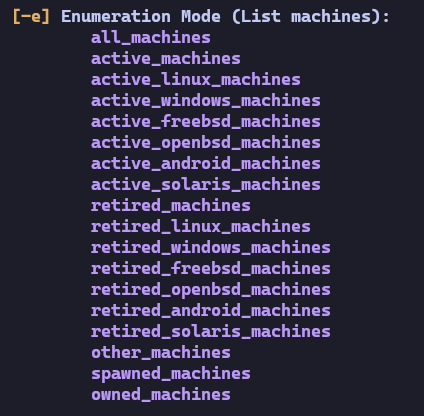
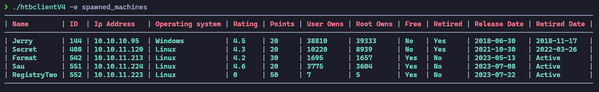
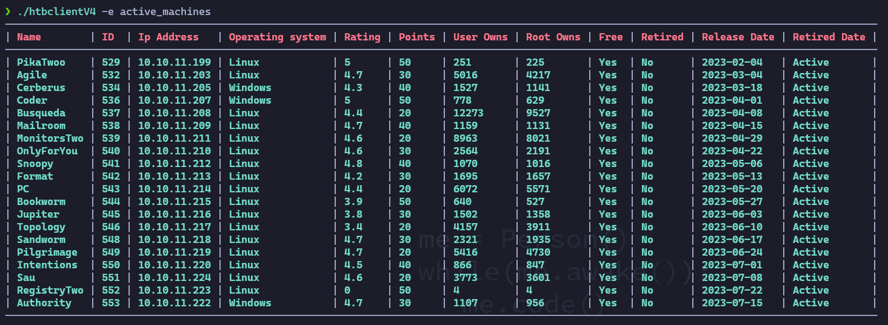
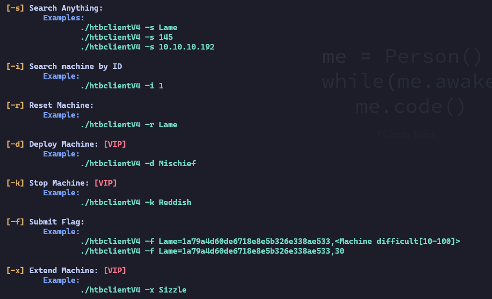
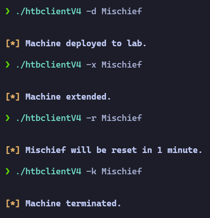

# htbClientV4

**htbclientV4** es una herramienta que funciona como un cliente de terminal basado en el de [s4vitar](https://github.com/s4vitar), pero usando algunos elementos de la version 4 de la api de Hackthebox.

¿Cómo me autentico?
======
Lo primero que debemos hacer es dirigirnos a la nueva interfaz de [Hack The Box](https://www.hackthebox.com). Una vez iniciada la sesión, tendremos que dirigirnos a los ajustes de nuestro perfil. Crearemos un nuevo "JSON Web Token" (los JSON Web Token tienen una "fecha de caducidad", por así decirlo, por eso deberemos elegir 1 año de validez). De todas formas, he creado un pequeño script en Python que podéis usar si queréis renovarlo cada poco, pero recomiendo hacerlo desde la web y añadir 1 año de validez. Recordad verificar la validez del JWT si veis que no funciona la herramienta.

Ahora deberemos obtener nuestro "API TOKEN" de la interfaz antigua de [Hack the box](https://hackthebox.eu/login). Una vez iniciemos sesión, pincharemos en nuestro perfil y deberemos hacer clic en el apartado "Settings".

Una vez dentro, nos dirigimos al apartado del API key y lo copiamos.

Ahora que ya tenemos el "JSON Web Token" y el "API Token", debemos introducirlos en el código. Simplemente al abrir el archivo se indican en las primeras líneas.

Esta utilidad cuenta con un modo de enumeración (**parámetro -e**) bastante rápido.

Con él podremos listar las máquinas desplegadas en el laboratorio de Hack The Box.

Si queremos ver las máquinas activas, también tenemos esa opción y las que se muestran en el panel de ayuda.

También tenemos modos de búsqueda más personalizados. Con el parámetro "-s" podemos buscar cualquier cosa, como nombres, IP, fechas, etc. Si queremos buscar las máquinas en base al identificador, recomiendo usar el parámetro "-i" ya que es más preciso.

Si inspeccionamos un poco más el panel de ayuda, nos daremos cuenta de que podemos parar/resetear/desplegar/enviar flags (algunos son VIP).

Para enviar la flag usaremos el siguiente método:

* htbclientV4 -f Lame=9d59efd64df62d3bc326dcb4ffc597cf,10

* El número 10 representa la dificultad personal que le asignamos a la máquina una vez hecha.

* Esta herramienta no es tan completa como la de s4vitar, pero en algunos aspectos es más rápida debido a la combinación de ambas versiones de la API de Hack The Box.

## Redes sociales de s4vitar y enlace a su academia
[Youtube](https://www.youtube.com/s4vitar)
[Instragram](https://www.instagram.com/s4vitarx/)
[Twitter](https://twitter.com/S4vitar)
[Linkedin](https://es.linkedin.com/in/s4vitar)
[Academia](https://hack4u.io/)

